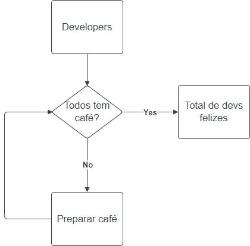
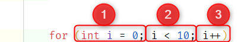

# DevelopersBR - Corujinhas

# Loops

## O que é um laço ou loop?

Loop é uma maneira de executar um trecho código repetidas vezes.

Um loop é uma maneira de executar um trecho código repetidas vezes. É composto te uma condição e código que será executado.

### Código
Qualquer tipo de código pode ser executado em um loop, não há restrições!
Entretanto, existem certos tipos de variáveis que são usadas para ajudar a controlar o que está acontecendo  durante as repetições. Essa variável normalmente é chamada de **contador**.

### Condições
As condições são usadas para verificar quantas vezes o trecho de código será repetido. Antes de cada execução (ou depois, dependendo do tipo da estrutura de repetição usada), a condição é verificada e se continuar verdadeira o código é executado. Os tipoe de condições podem ser:
- Verdadeiro ou Falso
- Um número especíco de vezes
- O número de elementos em uma coleção

# Tipos de loops

## While
É o tipo mais básico de loop, todos os demais derivam dele. Para while, for e foreach, a condição é verificada antes da execução, e se for verdadeira o código é executado. Normalmente é usado para comparações de verdadeiro e falso.

As principais características do while são:
- Enquanto uma condição for verdadeira(ou falsa), continue repetindo.
- Executa o trecho de código uma vez, volta ao inicio e verifica se a condição continua verdadeira e executa novamente.
- **Atenção!** Isso pode acontecer para sempre, desde que a condição continue verdadeira! Isso é chamado de **loop infinito** e na maioria dos casos não é desejado.

## Do While
Para do while, acontece o oposto, o código é executado e apenas após a condição é verificada.
Isso pode ser útil em casos onde pelo menos uma execução é sempre necessária.

## For
O for funciona da mesma maneira que o while. É recomendado seu uso para casos em que a quantidade de vezes que a repetição deve acontecer é conhecida.
Para declarar um for é necessária uma variável, chamada index ou i e são necessárias 3 declarações separadas por ponto e vírgula(;):

- Inicializar: Declaramos o valor inicial do índice
- Condição: Adicionamos a comparação que será usada para parar o loop 
- Iterar: Incrementamos o índice, normalmente com ++

## Foreach
O foreach é recomendado quando trabalhamos com coleções ou listas. Sua tradução é "para cada", o que significa o trecho de código será repetido uma vez para cada elemento da lista.